# RegEngine v2 - System Architecture

Complete architectural documentation with diagrams, data flows, and component specifications.

---

## Table of Contents

1. [System Overview](#system-overview)
2. [Component Architecture](#component-architecture)
3. [Data Flow](#data-flow)
4. [Graph Schema](#graph-schema)
5. [Deployment Architecture](#deployment-architecture)
6. [Security Architecture](#security-architecture)
7. [Scalability & Performance](#scalability--performance)

---

## 1. System Overview

### High-Level Architecture

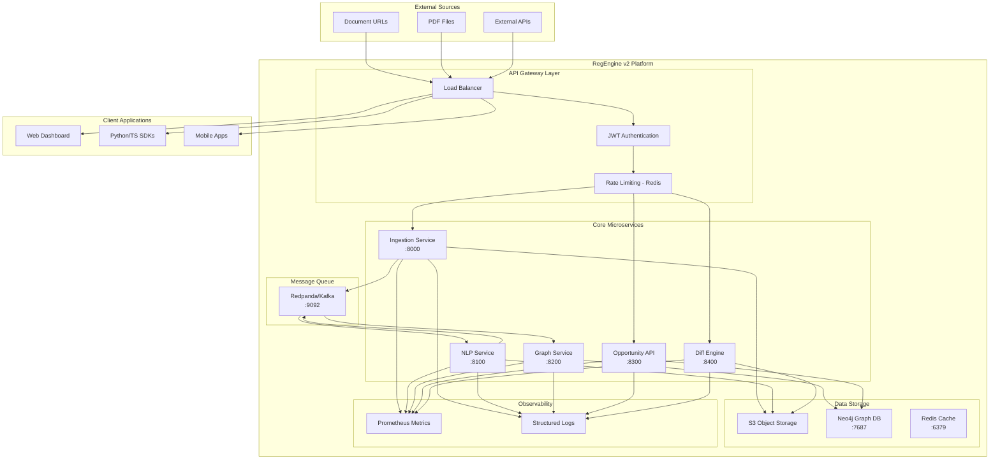

---

## 2. Component Architecture

### 2.1 Ingestion Service

**Purpose:** Fetch, normalize, and store regulatory documents.

**Technology Stack:**
- FastAPI 0.115.0
- Boto3 (S3 client)
- kafka-python
- pdfminer.six, pytesseract (OCR)
- Pydantic (validation)

**Key Components:**

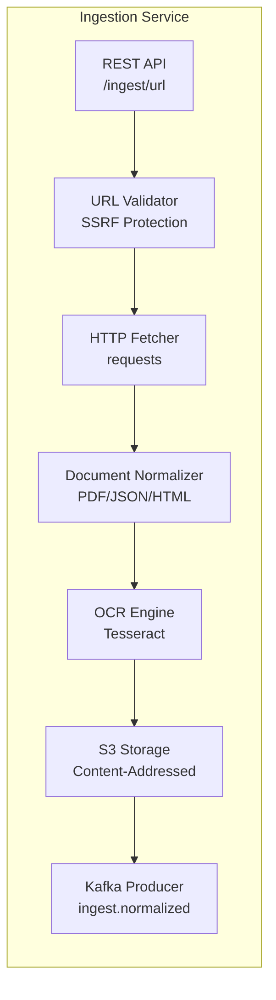

**API Endpoints:**
- `POST /ingest/url` - Ingest document from URL
- `POST /auth/token` - Generate JWT
- `GET /health` - Health check
- `GET /metrics` - Prometheus metrics

**Event Schema:**

```json
{
  "event_id": "uuid",
  "document_id": "sha256",
  "source_system": "SEC|EPA|EU|...",
  "source_url": "https://...",
  "raw_s3_path": "s3://bucket/raw/...",
  "normalized_s3_path": "s3://bucket/normalized/...",
  "content_sha256": "hash",
  "timestamp": "ISO8601"
}
```

---

### 2.2 NLP Extraction Service

**Purpose:** Extract regulatory entities using ML-based models.

**Technology Stack:**
- FastAPI 0.115.0
- kafka-python (consumer)
- Legal-BERT (planned) / enhanced regex (current)
- jsonschema (validation)

**Key Components:**

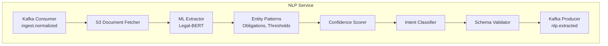

**Entities Extracted:**

| Entity Type | Pattern | Confidence |
|-------------|---------|------------|
| OBLIGATION | "shall", "must", "required to" | 0.9 |
| PROHIBITION | "shall not", "must not", "prohibited" | 0.95 |
| THRESHOLD | Numeric + unit (%, USD, tons) | 0.7-0.9 |
| JURISDICTION | "US", "EU", "California" | 0.9-0.95 |
| INCENTIVE | "tax credit", "grant", "subsidy" | 0.75-0.9 |
| PENALTY | "fine", "penalty", "violation" | 0.75-0.9 |
| DEADLINE | "by", "before", "within X days" | 0.8-0.85 |

**Event Schema:**

```json
{
  "event_id": "uuid",
  "document_id": "sha256",
  "source_url": "https://...",
  "entities": [
    {
      "type": "OBLIGATION|THRESHOLD|...",
      "text": "extracted text",
      "start": 123,
      "end": 456,
      "attrs": {
        "confidence": 0.9,
        "concept": "emissions",
        "value": 25.0,
        "unit": "percent"
      }
    }
  ],
  "timestamp": "ISO8601"
}
```

---

### 2.3 Graph Service

**Purpose:** Persist entities into Neo4j temporal graph.

**Technology Stack:**
- FastAPI 0.115.0
- neo4j 5.25.0 (Python driver)
- kafka-python (consumer)

**Key Components:**

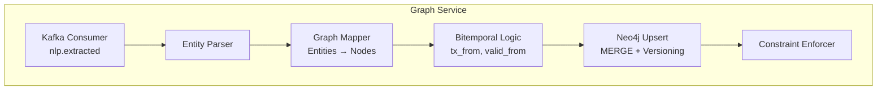

**Cypher Queries:**

- `CYPHER_UPSERT` - Main upsert with bitemporal versioning
- `CYPHER_PROVISION_HISTORY` - Get all versions of a provision
- `CYPHER_ACTIVE_PROVISIONS_AT_TIME` - Query by timestamp
- `CYPHER_PROVISION_CHANGES` - Query changes in time range

---

### 2.4 Opportunity API

**Purpose:** Query regulatory arbitrage and compliance gaps.

**Technology Stack:**
- FastAPI 0.115.0
- neo4j 5.25.0

**Key Components:**

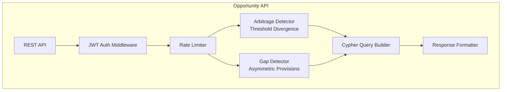

**API Endpoints:**

- `GET /opportunities/arbitrage?j1=US&j2=EU&rel_delta=0.2`
- `GET /opportunities/gaps?j1=EU&j2=US&limit=50`

---

### 2.5 Diff Engine

**Purpose:** Compare documents and detect changes.

**Technology Stack:**
- FastAPI 0.115.0
- difflib (Python standard library)
- boto3 (S3 client)

**Key Components:**

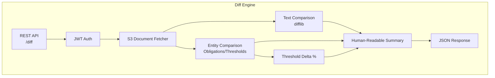

**Change Types:**

- `text_added` - New text sections
- `text_removed` - Deleted text
- `text_modified` - Changed text
- `obligation_added` - New obligations
- `obligation_removed` - Removed obligations
- `threshold_changed` - Threshold delta (with %)
- `jurisdiction_added` - New jurisdiction mentioned

---

## 3. Data Flow

### 3.1 End-to-End Ingestion Flow

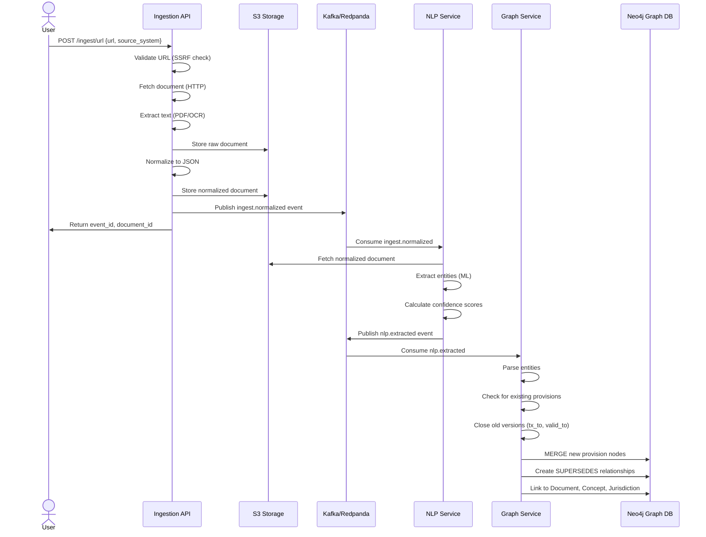

### 3.2 Query Flow (Arbitrage Detection)

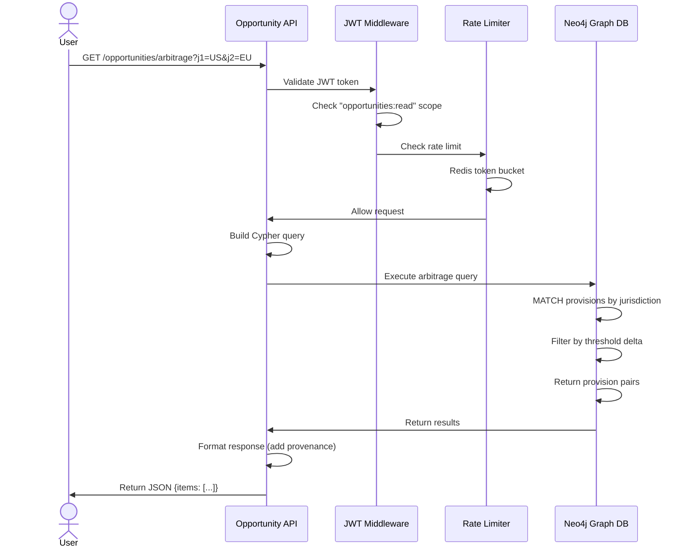

### 3.3 Diff Flow

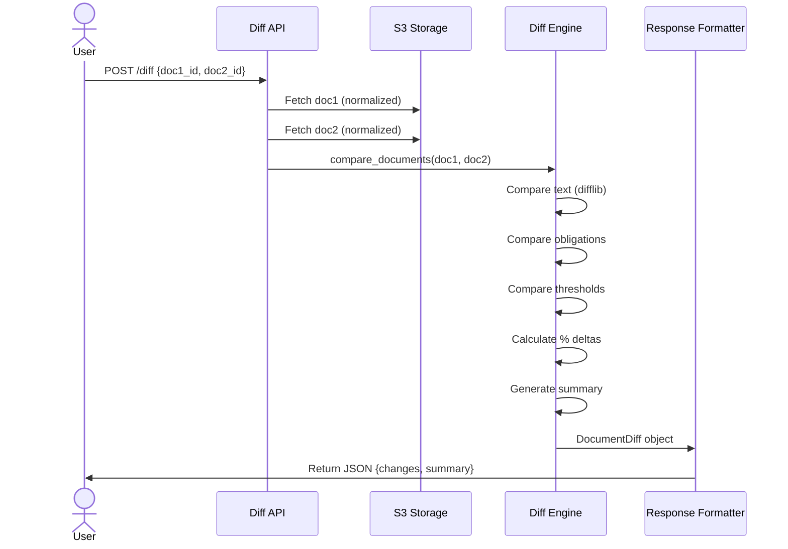

---

## 4. Graph Schema

### 4.1 Node Types

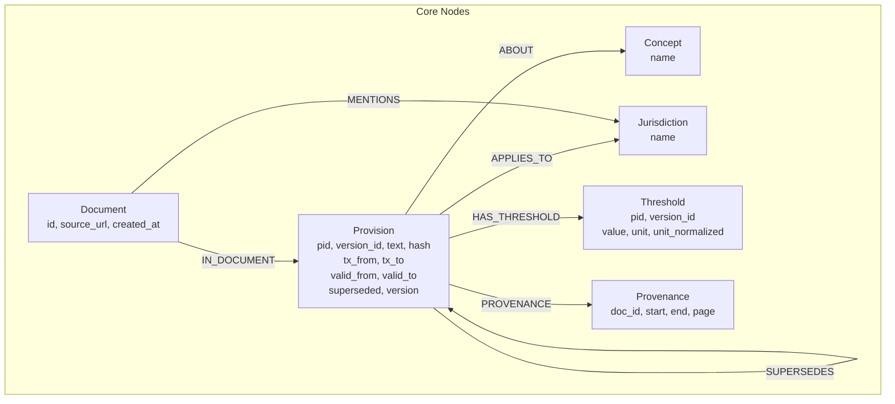

### 4.2 Bitemporal Model

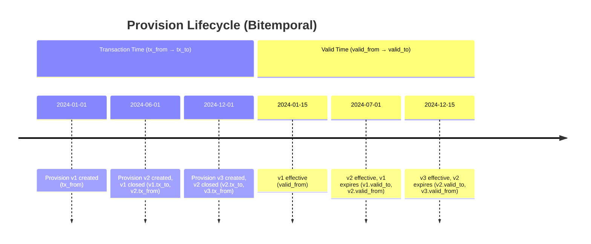

**Bitemporal Attributes:**

| Field | Type | Description |
|-------|------|-------------|
| `tx_from` | timestamp | When provision was created in DB |
| `tx_to` | timestamp \| null | When provision was superseded (null = current) |
| `valid_from` | timestamp | When regulation became effective |
| `valid_to` | timestamp \| null | When regulation expires (null = still valid) |
| `superseded` | boolean | True if newer version exists |
| `version` | integer | Version number (1, 2, 3, ...) |

**Querying Historical State:**

```cypher
// Get active provisions at specific time
MATCH (p:Provision)-[:IN_DOCUMENT]->(d:Document {id: $doc_id})
WHERE p.tx_from <= $timestamp
  AND (p.tx_to IS NULL OR p.tx_to > $timestamp)
  AND p.valid_from <= $timestamp
  AND (p.valid_to IS NULL OR p.valid_to > $timestamp)
RETURN p, d
```

### 4.3 Example Graph Queries

**Find all versions of a provision:**

```cypher
MATCH (p:Provision {pid: $pid})
OPTIONAL MATCH (p)-[:SUPERSEDES*]->(older:Provision)
RETURN p, older
ORDER BY p.version DESC
```

**Detect threshold changes between jurisdictions:**

```cypher
MATCH (p1:Provision)-[:HAS_THRESHOLD]->(t1:Threshold),
      (p1)-[:ABOUT]->(c:Concept),
      (p1)-[:APPLIES_TO]->(j1:Jurisdiction {name: $j1}),
      (p2:Provision)-[:HAS_THRESHOLD]->(t2:Threshold),
      (p2)-[:ABOUT]->(c),
      (p2)-[:APPLIES_TO]->(j2:Jurisdiction {name: $j2})
WHERE t1.unit_normalized = t2.unit_normalized
  AND abs(t1.value - t2.value) / t1.value > $rel_delta
RETURN c.name AS concept,
       t1.unit_normalized AS unit,
       t1.value AS v1,
       t2.value AS v2,
       p1, p2
```

---

## 5. Deployment Architecture

### 5.1 Development Environment

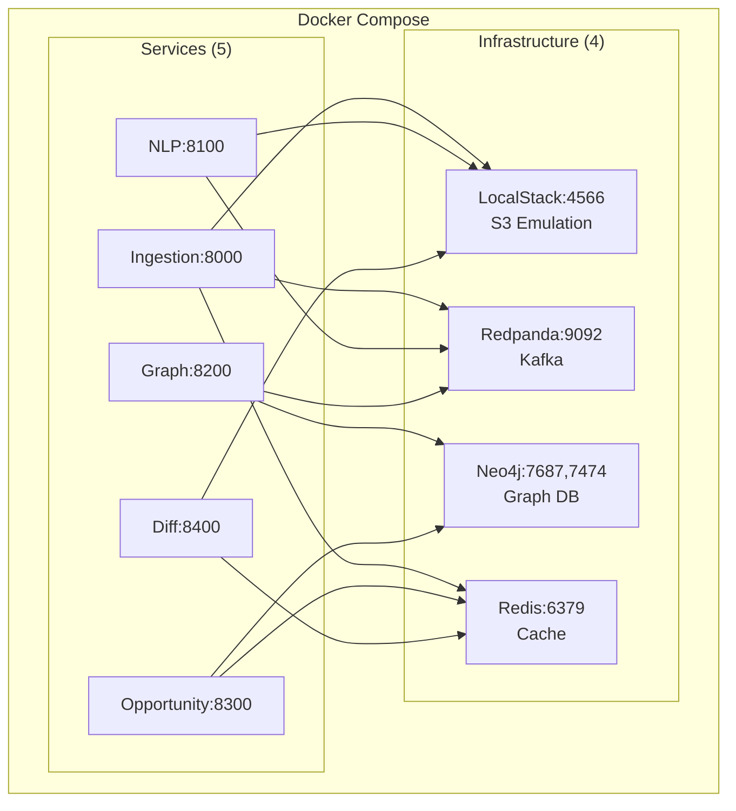

### 5.2 Production Environment (AWS)

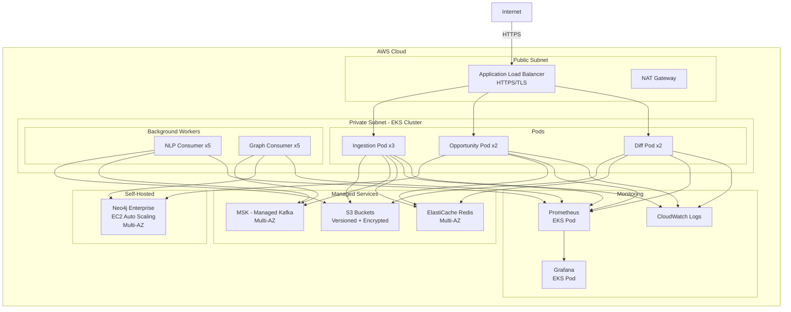

### 5.3 Multi-Region Deployment

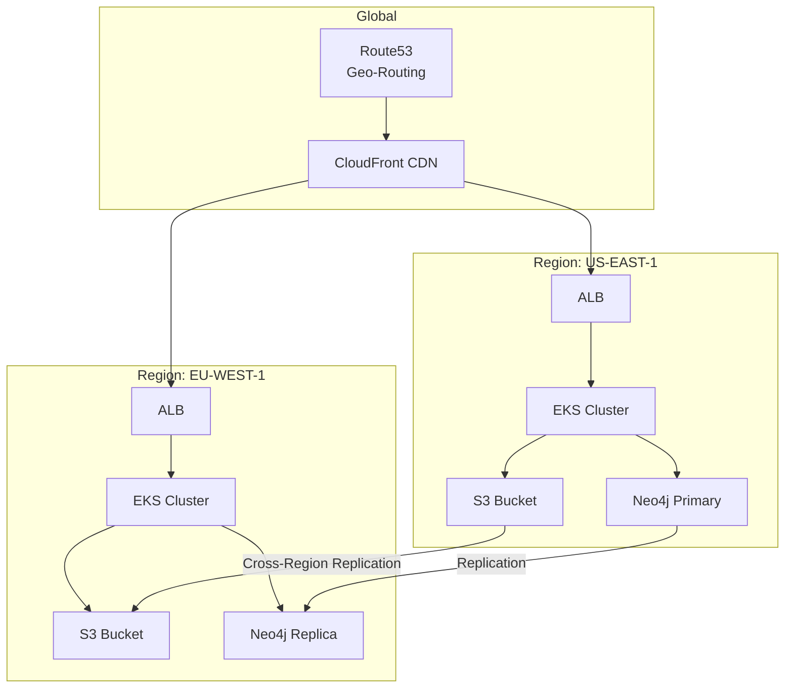

---

## 6. Security Architecture

### 6.1 Authentication Flow

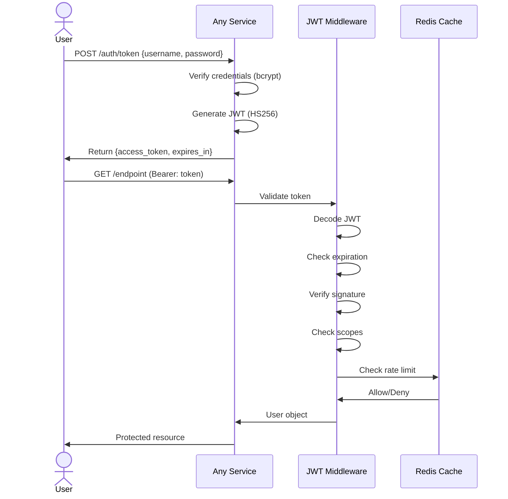

### 6.2 Network Security Layers

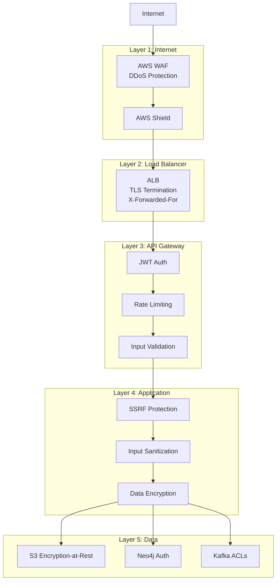

### 6.3 Secrets Management

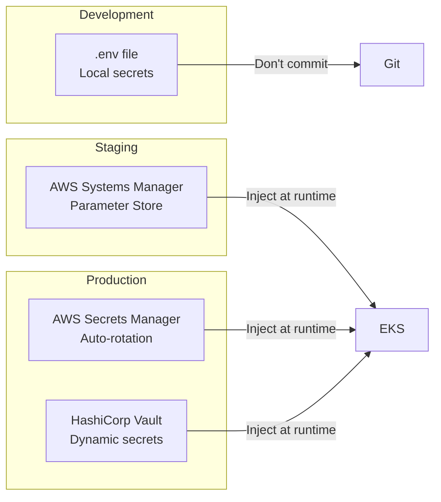

---

## 7. Scalability & Performance

### 7.1 Horizontal Scaling

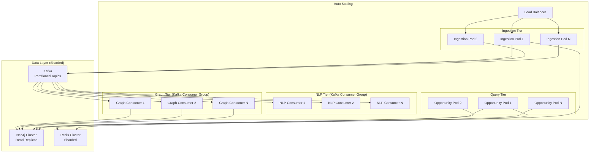

### 7.2 Performance Optimization Strategies

| Layer | Strategy | Impact |
|-------|----------|--------|
| **API** | Redis rate limiting | Prevent abuse, ensure SLA |
| **Ingestion** | Async S3 uploads | 3x throughput |
| **NLP** | Kafka consumer group (5 workers) | 5x parallelism |
| **Graph** | Batch upserts (100 provisions/tx) | 10x write speed |
| **Queries** | Neo4j indexes (Document.id, Provision.pid) | 50x query speed |
| **Caching** | Redis cache for frequent queries | 100x read speed |

---

## Appendix: Technology Decisions

### Why Neo4j?

- **Relationship-first:** Regulatory citations are inherently graphs
- **Cypher queries:** Expressive query language for complex patterns
- **Bitemporal support:** Native timestamp indexing
- **ACID compliance:** Data integrity for compliance use cases

### Why Kafka (Redpanda)?

- **Event sourcing:** Full audit trail of all documents
- **Decoupling:** Services can evolve independently
- **Replay:** Re-process historical documents
- **Scalability:** Partition-based parallelism

### Why FastAPI?

- **Performance:** Async/await for high throughput
- **Auto-docs:** OpenAPI/Swagger generation
- **Type safety:** Pydantic validation
- **Developer experience:** Fast iteration

---

**Document Version:** 2.0.0
**Last Updated:** 2025-11-18
